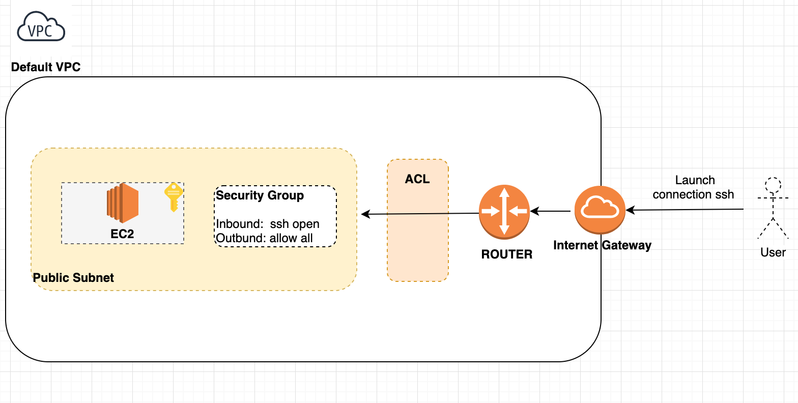

Getting started with Terraform 
==============================

We will deploy an EC2 (Ubuntu18.04) via terraform and we connect to the machine via SSH.



Step 1:
-------

```shell script
cd terraform # Go to terraform directory
terraform init # Get aws plugins
```

Go to edit the terraform.tfvars, you need to pass the Private/Public ssh path.
Example : 

````hcl-terraform
aws_public_key_ssh_path = "<MY_PATH>/<MY_PUBLIC_KEY>.pub"
aws_private_key_ssh_path = "<MY_PATH>/<MY_PRIVATE_KEY>"
````

Step 2:
-------

```shell script
cd aws # Go to terraform directory
terraform init # Get aws plugins
terraform plan # To get a dry run
terraform apply # Apply creation of the infra
```

Step 3:
-------

Test ssh connection, go to terraform.tfstate and get the value of the key : ssh_connect_cli.
This is the command line to connect to your machine.

Example:

````json
{
  "version": 4,
  "terraform_version": "0.12.9",
  "serial": 5,
  "outputs": {
    "ssh_connect_cli": {
      "value": "ssh -i ~/.ssh/id_rsa_aws ubuntu@ec2-xx-xx-xx-xx.eu-west-1.compute.amazonaws.com",
      "type": "string"
    }
  }
}
````