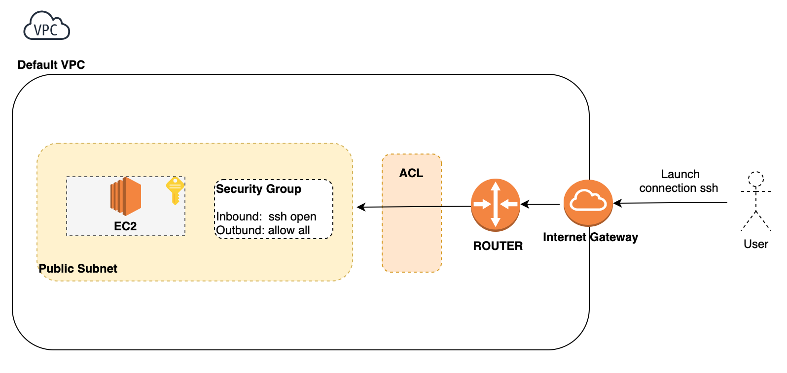

Getting started with Terraform 
==============================

We will deploy an EC2 with Ubuntu18.04 via terraform and we connect to it via SSH.



Step 1:
-------

```shell script
cd aws # Go to terraform directory
terraform init # Get aws plugins
```

Go to edit the terraform.tfvars, you need to pass the ssh Private/Public path.
Example : 

````hcl-terraform
aws_public_key_ssh_path = "<MY_PATH>/<MY_PUBLIC_KEY>.pub"
aws_private_key_ssh_path = "<MY_PATH>/<MY_PRIVATE_KEY>"
````

Step 2:
-------

```shell script
cd aws # Go to terraform directory
terraform init # Get aws plugins
terraform plan # To get a dry run
terraform apply # Apply creation of the infra
```

Step 3:
-------

Test ssh connection, go to terraform.tfstate and get the value of the key : ssh_connect_cli.
This is the command line to connect to your machine.

